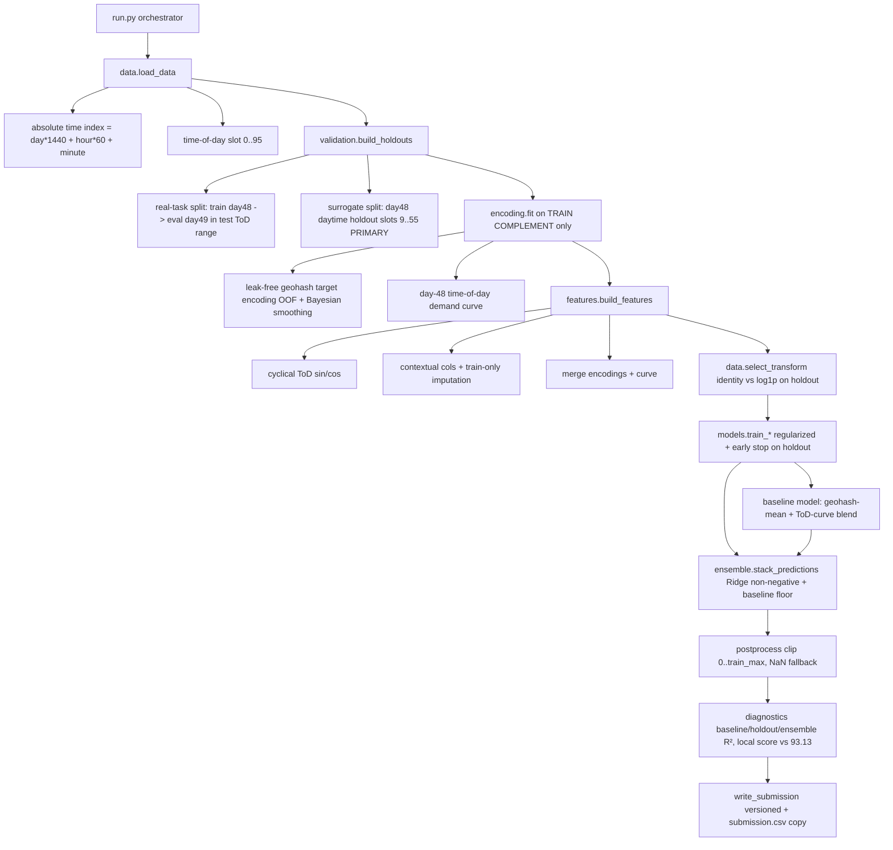

# Design Document

## Overview

This design refactors the existing Stratam pipeline so that its local performance estimate becomes a trustworthy predictor of the HackerEarth Online_Score, and so that the model relies only on signal that exists at prediction time. The competition metric is `score = max(0, 100 * r2_score(actual, predicted))`.

### Problem recap

The dataset is a two-day snapshot, not a multi-week time series:

- `train.csv` (77,299 rows) = all 96 quarter-hour slots of **day 48** (69,427 rows) + **day 49** morning slots `0:00`–`2:00` (7,872 rows).
- `test.csv` (41,778 rows) = **day 49** daytime slots `2:15`–`13:45`, no `demand` column.
- There is **no time overlap** between train and test.

The current pipeline builds `lag_{1,2,3,6,12,24,48,168}`, `rolling_*` over windows up to 168, `ewm_24`, and `demand_vs_loc_mean = lag_1 / loc_mean`. With only two days of history these target-shifted features recover `demand_t` from `demand_{t-1}` of the same geohash, inflating in-sample R² to ~0.95. The `build_compute_df` history-tail mechanism cannot propagate those lags across the contiguous unlabeled daytime block of day 49, so the apparent signal collapses at test time and the Online_Score falls to ~83. The current `chronological_split` / `time_kfold_split` validators fold within the mixed day-48 + day-49-morning data and never reproduce the real day-48 → day-49-daytime task, so they report a falsely high 0.93–0.95.

### Approach

1. **Remove leakage** — delete lag / rolling / EWM / lag-derived interaction features and the `build_compute_df` history tail entirely (Requirement 1).
2. **Rebuild features from generalizable signal** — leak-free (out-of-fold / smoothed Bayesian) geohash target encodings, a day-48 time-of-day demand curve, cyclical encodings of the time-of-day slot, and the contextual columns, with train-only imputation (Requirement 3).
3. **Redesign validation** — a day-48 → day-49 aligned validator plus a **day-48 daytime holdout surrogate** that matches the test time-of-day distribution and serves as the primary model-selection metric, with all encodings fit on the complement only (Requirement 2).
4. **Tune for generalization** — regularized LightGBM / XGBoost / CatBoost with early stopping on the holdout, a data-driven identity-vs-`log1p` transform choice, and a robust baseline model blended in as a floor (Requirement 4).
5. **Honest reporting** — record local score and CV_LB_Gap against the leaderboard top of 93.13; reproducible from a single seed (Requirement 6).
6. **Preserve the submission contract** — 41,778 rows, `Index` + `demand`, clipped to `[0, train_max]`, versioned outputs (Requirement 5).

### Measured baselines (proper day-48 → day-49 holdout)

These bound the achievable ceiling and anchor the honest target (Requirement 6, Non-Goals):

| Baseline | R² |
| --- | --- |
| Global mean | ≈ −0.01 |
| Per-geohash mean | ≈ 0.656 |
| Geohash × time-of-day mean | ≈ 0.52 (day-49 labels are morning-only) |
| In-sample geohash + timestamp mean (the illusion) | ≈ 0.975 |

Surpassing the leaderboard top (93.13, i.e. R² ≈ 0.9313) is the success target. Reaching ~99.99 is an explicit non-goal on this noisy R² regression.

## Architecture

The module layout (`run.py`, `config.py`, `src/{schema,data,spatial,features,validation,models,ensemble,postprocess,diagnostics}.py`) is preserved. Responsibilities are re-scoped: `spatial.py` becomes the home of leak-free target encoding and the time-of-day curve, `features.py` loses all history-based feature groups, and `validation.py` is replaced with task-mirroring splitters.



### Data flow principle (leakage boundary)

Every target-derived value (geohash encodings, time-of-day curve, transform choice, early-stopping decision) is fit on a **fitting partition** that excludes the rows it will later score. There are two fitting contexts:

- **Validation context**: fit on the holdout's training complement, score the holdout. Used to choose the transform, tune early stopping, and report Holdout_R2.
- **Final/submission context**: fit on the full `train.csv`, score `test.csv`. Used to produce the submission.

The same encoding code runs in both contexts; only the input partition differs. This is the single most important structural change relative to the current pipeline.

## Components and Interfaces

### config.py (Requirement 6.4, Requirement 1)

Remove or deprecate the long-history knobs and add encoding / holdout configuration.

Removed / deprecated:
- `MAX_LAGS` (was 168)
- `ROLLING_WINDOWS` (was `[3, 6, 12, 24, 168]`)
- `HOLDOUT_FRAC` (replaced by explicit slot-window holdout)

Added:
```python
SEED = 42                      # unchanged, single source of randomness (Req 6.4)

# Test-data time-of-day window (quarter-hour slots), 2:15-13:45 inclusive.
TEST_TOD_SLOT_MIN = 9          # floor((2*60+15)/15)
TEST_TOD_SLOT_MAX = 55         # floor((13*60+45)/15)

# Leak-free target encoding
TE_SMOOTHING_ALPHA = 20.0      # Bayesian prior weight: (sum + prior*alpha)/(count + alpha)
TE_N_FOLDS = 5                 # out-of-fold folds for in-training encoding

# Modeling / generalization-first regime
N_ESTIMATORS = 5000            # max trees; early stopping cuts earlier
EARLY_STOPPING = 100
```

`seed_everything()` is retained unchanged and remains the only seeding entry point.

### src/data.py — time handling and loading (Requirement 3.2, Requirement 6)

`load_data(train_path, test_path) -> (train_df, test_df, schema)`

- Parse `timestamp` (`HH:MM`) into hour and minute; **do not** build the synthetic `"2026-01-01" + day` datetime any more. The artificial calendar drove `dt.year/month/dayofweek/...`, which are constant or meaningless across only days 48–49.
- Construct:
  - `abs_time = day * 1440 + (hour * 60 + minute)` — a strictly increasing absolute-minute index used only for ordering and split logic.
  - `tod_slot = (hour * 60 + minute) // 15` — integer in `0..95`.
  - Keep `day` (48 / 49) as a model feature.
- Sort by `abs_time` then `geohash`.

`select_transform(y_train_part, y_eval_part, fit_predict_fn) -> ("identity" | "log1p", details)` (Requirement 4.2–4.4)

Replaces the skew-based `apply_target_transform`. Trains the candidate transform on the holdout training complement, scores the holdout, and:
- returns the transform with the higher Holdout_R2,
- returns `"identity"` on a tie (4.3),
- raises `TransformSelectionError` if both transforms yield Holdout_R2 ≤ 0 (4.4).

`load_data` no longer mutates the target in place; transform application becomes an explicit, reversible step keyed off the selected transform.

The synthetic-calendar temporal/cyclical block (`year`, `month`, `day_of_month`, `day_of_week`, `day_of_year`, `week_of_year`, `quarter`, `is_weekend`, and the `dow_*`/`month_*`/`doy_*` sin/cos pairs) is **dropped**. Retained time features are computed from the real time-of-day: `tod_slot`, `tod_sin`/`tod_cos` (period 96), `minute_of_day_sin`/`cos` (period 1440), `is_peak_hour`, `is_night`, and `day`.

### src/spatial.py — leak-free encoding and time-of-day curve (Requirements 1.4, 1.5, 3.1, 3.3, 3.7)

This module is repurposed from "compute stats once on full train" to a fit/transform encoder that respects the leakage boundary.

`class TargetEncoder` (or equivalent function pair `fit_geohash_encoding` / `transform_geohash_encoding`):

- `fit(df_fit, target_col, alpha)` computes, per geohash, smoothed statistics using a global prior:
  - `geohash_mean = (sum + prior_mean * alpha) / (count + alpha)`
  - `geohash_median`, `geohash_std` (std `NaN`/single-row → 0)
  - `geohash_demand_rank` derived from the smoothed mean
  - stores `global_prior_mean` (the fitting partition's mean) for fallback
- `transform(df)` merges encodings by geohash; **Unseen_Geohash** rows receive `global_prior_mean` and a neutral rank (3.7).
- `fit_oof(df_train, target_col, alpha, n_folds, seed)` produces **out-of-fold** encodings for the training rows: for each fold, fit on the other folds and assign to the held-out fold, so a row's encoding never uses its own target (1.4). This is what the model trains on.
- For the **validation** holdout, `fit` runs on the holdout training complement only and `transform` is applied to the holdout (no eval target used). For the **final** submission, `fit` runs on full `train.csv` and `transform` is applied to `test.csv`.

`fit_tod_curve(df_day48, target_col) -> Series[tod_slot -> mean_demand]` (Requirement 3.3, 1.5)

- Mean demand per `tod_slot` computed from **day 48 only**, so the curve generalizes to day-49 daytime where labels are absent. In the validation context the curve is fit on the day-48 training complement (excluding the held-out day-48 daytime slots). The curve is the strongest generalizable daytime signal and intentionally spans the full slot range `0..95` even though day 49's labelled rows are morning-only (1.5).
- Optional: a heavily smoothed `geohash × coarse-tod-bucket` mean, fit day-48-only / complement-only when enabled.

These encodings are explicitly **Leak_Free_Encoding** features and are therefore retained even though they are derived from other rows' targets and span more than one day (Requirement 1.4, 1.5).

### src/features.py — feature builder (Requirements 1.1–1.3, 1.6, 3.2, 3.4–3.6)

`build_features(df, encoder, tod_curve, schema, category_maps, impute_values) -> DataFrame`

Removed entirely:
- `build_compute_df` (history-tail mechanism) — deleted.
- Feature group D (`lag_*`), group E (`rolling_*`, `ewm_mean_24`), and the lag-derived `demand_vs_loc_mean` / `hour_x_loc_rank` interactions. These cannot be computed leak-free for the contiguous daytime test block and are the root cause (1.1, 1.2, 1.3, 1.6).
- The synthetic-calendar temporal/cyclical features (see `data.py`).

Retained / new feature groups:
- **Time-of-day cyclical** (3.2): `tod_sin`, `tod_cos` (period 96), `minute_of_day_sin`/`cos` (period 1440), plus `is_peak_hour`, `is_night`, `day`.
- **Leak-free encodings merge** (3.1, 3.7): geohash smoothed mean/median/std/rank from the encoder, with unseen-geohash fallback.
- **Time-of-day curve merge** (3.3): `tod_curve_mean` joined on `tod_slot`.
- **Contextual columns** (3.4): `RoadType`, `NumberofLanes`, `LargeVehicles`, `Landmarks`, `Temperature`, `Weather`. These are row-level (they vary within a geohash), so they are kept as ordinary row features.
- **Consistent categorical mapping** (3.5): integer codes from `category_maps` built over the union of train+test categories (retained from current code).

`build_imputers(train_df) -> impute_values` and null handling (Requirement 3.6):
- `Temperature` → train median (with optional per-geohash median fallback), computed from training data only.
- `RoadType`, `Weather` → a dedicated `"Missing"` category appended to their `category_maps`, so missingness is itself a signal.
- `NumberofLanes` is complete (no imputation).
- Imputation values are derived from the **fitting partition only** in the validation context and from full train in the final context. Imputation touches only the columns that are null in a given row (3.6).

`select_feature_cols(...)` is retained but now operates over the reduced, leak-free feature set; `reduce_memory` is retained unchanged.

### src/validation.py — task-mirroring validation (Requirement 2)

Replaces `chronological_split` and `time_kfold_split`.

`build_real_task_holdout(train_df, test_tod_min, test_tod_max) -> HoldoutSplit` (2.1–2.4)
- Train partition = all day-48 rows; eval partition = day-49 rows.
- Filter eval to `tod_slot ∈ [test_tod_min, test_tod_max]` to align with the test daytime window (2.2).
- If matching day-49 slots exist → eval on them with status `OK` (2.3).
- If day-49 rows exist but none fall in `[9, 55]` → return status `FAILED_NO_MATCHING_SLOTS` and report the absence (2.4). On the actual data the day-49 train rows are morning-only (slots `0..8`), so this validator reports `FAILED_NO_MATCHING_SLOTS`; the pipeline logs it and proceeds with the surrogate below as the model-selection metric. (See "Design decision: validation tension" below.)

`build_day48_daytime_holdout(train_df, test_tod_min, test_tod_max, seed) -> HoldoutSplit` (2.1, 2.5 — primary surrogate)
- Eval partition = day-48 rows whose `tod_slot ∈ [9, 55]` (the same clock window as the test set).
- Train partition = the complement (day-48 rows outside that window + day-49 morning rows).
- This holdout matches the test time-of-day distribution and is documented as **the primary model-selection metric**, the most faithful proxy for the real test.
- All encodings, the time-of-day curve, imputers, the transform choice, and early stopping that are used to score this holdout are fit on the **train partition only** (2.5).

`HoldoutSplit` carries `train_idx`, `eval_idx`, `status`, and `coverage_note`. The validator reports Holdout_R2 and the local score `max(0, 100 * r2)` (2.6) and the CV_LB_Gap against the recorded Online_Score as the primary success metric (2.7).

**Design decision: validation tension.** Requirement 2.4 says the aligned day-48 → day-49 validator must "fail the validation run" when no day-49 slot matches the test window, yet Requirements 4 and 5 require the pipeline to train and emit a submission. These are reconciled by scoping "the validation run" to the aligned validator specifically: it returns a `FAILED_NO_MATCHING_SLOTS` status and reports the absence, while the day-48 daytime holdout surrogate drives transform selection, early stopping, and model selection. This interpretation is surfaced here for review; if the user prefers a hard pipeline abort on 2.4, the orchestrator can be configured to halt instead.

### src/models.py — generalization-first training (Requirement 4)

`ModelResult` dataclass is retained. The three trainers (`train_lightgbm`, `train_xgboost`, `train_catboost`) are retained with GPU→CPU fallback, but:
- Hyperparameters move to a stronger-regularization regime for a tiny feature set: lower `num_leaves` / `max_depth` / `depth`, higher `min_child_samples` / `min_child_weight` / `l2_leaf_reg`, retained subsampling, higher L1/L2.
- **Out-of-fold predictions** are generated with `TE_N_FOLDS`-fold OOF encodings so the OOF layer is itself leak-free (4.1, 4.5).
- **Early stopping** uses the day-48 daytime holdout eval set rather than a chronological tail (4.6).
- Each trainer consumes the leak-free encoded features only (4.1).

`train_baseline(train_part, eval_part, encoder, tod_curve) -> ModelResult` (Requirement 4, robustness floor)
- A simple, robust predictor: a blend of the leak-free geohash mean and the day-48 time-of-day curve (e.g. `w * geohash_mean + (1 - w) * tod_curve_mean`, with unseen-geohash fallback to the curve / global prior).
- Baselines already reach R² ≈ 0.66+, so this model both guards against GBM overfitting and provides an ensemble floor.

### src/ensemble.py — stacking with a floor (Requirement 4.5)

`stack_predictions(results, y_train, baseline_result) -> (final_preds, info)`
- Ridge meta-learner fit on **out-of-fold predictions only** (4.5), retained from current code, including the non-negative-weight fallback.
- The baseline model participates in the stack (or is used as a floor when the GBM blend underperforms it on the holdout), so the ensemble cannot score worse than the robust baseline on the surrogate holdout.

### src/postprocess.py — submission contract (Requirement 5)

`postprocess(preds, transform, train_path, target_col) -> preds`
- Inverse-transform (`expm1`) only when the selected transform is `log1p`.
- Clip to `[0, train_max]` where `train_max` is the maximum demand in `train.csv` (5.4, 5.5).
- **Remove integer rounding** — the target is continuous in `~[6e-7, 1.0]`; rounding would zero out nearly all predictions. The current integer-detection branch is deleted.
- Replace any residual `NaN`/`Inf` with the global train-mean fallback (5.6).

`write_submission(preds, test_idx, test_path, submission_path, target_col, id_col)`
- Exactly 41,778 data rows, columns `Index` and `demand` (5.1, 5.2).
- `Index` populated from `test.csv` and reindexed to original test order (5.3).
- Verify shape and null-freeness; retained from current code.

### run.py — orchestration and versioned outputs (Requirements 5.7, 5.8, 6)

- Keeps the run-id versioning (`submission_N.csv`, `metrics_N.json`, `feature_importance_N.{csv,png}`, `shap_summary_N.png`) and the `submission.csv` / `metrics.json` copies (5.7, 5.8).
- New order: `load_data → build_holdouts → fit encoders/curve/imputers on holdout-train → build_features → select_transform → train models + baseline (early-stop on surrogate holdout) → stack → refit encoders on full train → build test features → predict → postprocess → diagnostics → write_submission`.
- The CUDA assertion is relaxed to a warning with CPU fallback so the pipeline remains runnable and testable without a GPU (the model trainers already implement device fallback).
- `seed_everything(SEED)` is called once before any stochastic step (6.4, 6.5).

### src/diagnostics.py — honest reporting (Requirement 6.1)

Retains feature importance and SHAP. Adds an explicit printout and metrics entries for:
- baseline R² (geohash mean) on the surrogate holdout,
- Holdout_R2 per model,
- ensemble Holdout_R2,
- the local score `max(0, 100 * r2)`,
- the CV_LB_Gap vs the recorded Online_Score, compared against the 93.13 leaderboard top.

## Data Models

### Schema dict (from `src/schema.py`, unchanged)
```
{
  timestamp_col: "timestamp",
  location_cols: ["geohash"],
  target_col:    "demand",
  categorical_cols: ["RoadType", "LargeVehicles", "Landmarks", "Weather", ...],
  id_col:        "Index",
}
```

### Derived time fields (added in `load_data`)
```
abs_time : int   # day*1440 + hour*60 + minute (ordering only)
tod_slot : int   # 0..95
day      : int   # 48 or 49 (kept as feature)
```

### EncodingTables (produced by `TargetEncoder.fit`)
```
geohash_mean   : Map[geohash -> float]   # Bayesian-smoothed
geohash_median : Map[geohash -> float]
geohash_std    : Map[geohash -> float]
geohash_rank   : Map[geohash -> int]
global_prior_mean : float                # unseen-geohash fallback
tod_curve_mean : Map[tod_slot -> float]  # day-48-only / complement-only
```

### ImputeValues (produced by `build_imputers`)
```
temperature_median : float               # train-only
roadtype_missing   : "Missing" category
weather_missing    : "Missing" category
```

### HoldoutSplit (produced by `validation`)
```
train_idx     : Index
eval_idx      : Index
status        : "OK" | "FAILED_NO_MATCHING_SLOTS"
coverage_note : str
kind          : "real_task" | "day48_daytime_surrogate"
```

### ModelResult (from `src/models.py`, retained)
```
name, oof, test_preds, fold_rmses, best_iters, elapsed, final_model
```

### RunMetrics (written to `metrics_N.json`, extended — Requirement 6.1)
```
{
  transform_selected : "identity" | "log1p",
  baseline_holdout_r2 : float,
  model_holdout_r2 : { LightGBM, XGBoost, CatBoost },
  ensemble_holdout_r2 : float,
  local_score : float,                 # max(0, 100*r2)
  recorded_online_score : float|null,
  cv_lb_gap : float|null,
  leaderboard_top : 93.13,
  real_task_validation_status : "OK" | "FAILED_NO_MATCHING_SLOTS"
}
```

### Submission_File (Requirement 5)
```
Index : int   # from test.csv, original order
demand: float # clipped to [0, train_max], no NaN, continuous (no rounding)
# exactly 41,778 data rows
```

## Correctness Properties

*A property is a characteristic or behavior that should hold true across all valid executions of a system — essentially, a formal statement about what the system should do. Properties serve as the bridge between human-readable specifications and machine-verifiable correctness guarantees.*

The prework analysis consolidated the testable acceptance criteria into the distinct properties below, eliminating redundancy (leakage criteria 1.1–1.3/1.6 merged into one invariant; encoding criteria 1.4/1.5/3.1 merged; split criteria 2.1/2.3 merged; bounds criteria 5.4/5.5 merged; contract criteria 5.1/5.2/5.3 merged). Reporting, structural, versioning, and policy criteria are validated by unit/integration tests in the Testing Strategy rather than property tests.

### Property 1: No feature depends on a row's own or neighboring shifted target

*For any* generated multi-geohash training frame, the feature set produced by `build_features` SHALL contain no column whose values equal a within-geohash shift, rolling aggregation, or EWM aggregation of the target, and `build_features` SHALL succeed and produce the same feature columns when the target column is absent or all-NaN.

**Validates: Requirements 1.1, 1.2, 1.3, 1.6**

### Property 2: Geohash target encodings are leak-free, present, and shrink toward the prior

*For any* generated training frame (including frames spanning both day 48 and day 49), each row's out-of-fold geohash encoding SHALL equal the encoding fit on the complement of that row's fold (independent of the row's own target — mutating only that row's target SHALL NOT change its own encoding), the geohash encoding columns SHALL be present in the feature set, and each smoothed geohash mean SHALL lie between the global prior mean and the raw geohash group mean.

**Validates: Requirements 1.4, 1.5, 3.1**

### Property 3: Day-48 time-of-day curve is correct and leak-free

*For any* generated frame, the time-of-day curve value for each present slot SHALL equal the mean demand of the fitting partition's day-48 rows at that slot, and SHALL NOT change when day-49 target values are mutated.

**Validates: Requirements 3.3, 1.5**

### Property 4: Time-of-day cyclical encoding is a unit-circle, periodic mapping

*For any* time-of-day slot in `0..95`, the encoded pair `(tod_sin, tod_cos)` SHALL satisfy `tod_sin² + tod_cos² ≈ 1`, and slots that differ by a full period SHALL map to the same point.

**Validates: Requirements 3.2**

### Property 5: Categorical mapping is consistent across train and test

*For any* pair of train and test frames, every category value present in both SHALL map to an identical integer code in the encoded train frame and the encoded test frame.

**Validates: Requirements 3.5**

### Property 6: Imputation uses train-derived values and touches only null cells

*For any* frame with injected nulls in `RoadType`, `Temperature`, or `Weather`, after imputation those columns SHALL contain no nulls, every originally non-null cell SHALL be unchanged, and every imputed cell SHALL equal the train-derived imputation value (the `"Missing"` category for `RoadType`/`Weather`, the train median for `Temperature`).

**Validates: Requirements 3.6**

### Property 7: Unseen geohashes receive the train-derived fallback encoding

*For any* test frame containing geohashes absent from the training frame, the geohash demand encoding for those rows SHALL equal the train-derived global prior mean and the neutral fallback rank.

**Validates: Requirements 3.7**

### Property 8: Real-task split trains on day 48 and evaluates on aligned day-49 daytime rows

*For any* generated frame containing day-48 and day-49 rows where day-49 includes slots within `[9, 55]`, the real-task holdout's train partition SHALL contain only day-48 rows and its eval partition SHALL contain exactly the day-49 rows whose `tod_slot` is within `[9, 55]`, with status `OK`.

**Validates: Requirements 2.1, 2.2, 2.3**

### Property 9: Validator excludes eval-fold targets from all fitted artifacts

*For any* holdout split, the encodings, time-of-day curve, and imputation values applied to the eval partition SHALL be identical whether or not the eval-partition target values are mutated (every fitted artifact used to score the eval fold depends only on the train partition).

**Validates: Requirements 2.5**

### Property 10: Transform selection chooses the higher Holdout_R2

*For any* pair of holdout R² values for the identity and `log1p` transforms, `select_transform` SHALL return the transform with the higher Holdout_R2.

**Validates: Requirements 4.2**

### Property 11: Submission contract — row count, columns, and Index order

*For any* test frame and aligned prediction vector, the written submission SHALL contain exactly as many data rows as the test frame (41,778 for the competition data), SHALL have exactly the two columns `Index` and `demand`, and its `Index` column SHALL equal the test frame's `Index` values in their original order.

**Validates: Requirements 5.1, 5.2, 5.3**

### Property 12: Predictions are bounded to [0, train_max]

*For any* raw prediction vector (including negative and over-range values), every postprocessed demand value SHALL be greater than or equal to zero and less than or equal to the maximum demand observed in the training data.

**Validates: Requirements 5.4, 5.5**

### Property 13: Null predictions are replaced by a non-negative fallback

*For any* prediction vector containing `NaN` or `Inf` values, the postprocessed output SHALL contain no nulls and SHALL replace each such value with the defined non-negative fallback.

**Validates: Requirements 5.6**

### Property 14: Predictions are deterministic given seed and inputs

*For any* fixed input frame, configuration, and non-negative seed, two successive executions of the prediction path SHALL produce identical predicted demand vectors, and those values SHALL lie within `[0, train_max]`.

**Validates: Requirements 6.5, 6.4**

## Error Handling

| Condition | Component | Handling |
| --- | --- | --- |
| Day-49 rows present but none in `[9, 55]` | `validation.build_real_task_holdout` | Return `status = FAILED_NO_MATCHING_SLOTS`, report absence; pipeline logs and proceeds with the day-48 daytime surrogate as the model-selection metric (Req 2.4). |
| Both identity and `log1p` yield Holdout_R2 ≤ 0 | `data.select_transform` | Raise `TransformSelectionError`; abort the training run with the message that no transform achieved a positive Holdout_R2 (Req 4.4). |
| Identity and `log1p` Holdout_R2 tie | `data.select_transform` | Select identity (Req 4.3). |
| Unseen geohash at transform time | `spatial.TargetEncoder.transform` | Assign `global_prior_mean` + neutral rank fallback (Req 3.7). |
| Null in `RoadType` / `Temperature` / `Weather` | `features.build_features` | Impute from train-derived values, only the null columns (Req 3.6). |
| Residual `NaN` / `Inf` in predictions | `postprocess.postprocess` | Replace with non-negative global-mean fallback (Req 5.6). |
| Predictions out of physical range | `postprocess.postprocess` | Clip to `[0, train_max]` (Req 5.4, 5.5). |
| GPU / CUDA unavailable | `run.py`, `models._fit_*` | Warn and fall back to CPU (relaxed from the current hard assertion) so the pipeline stays runnable and testable. |
| Test-order / row-count mismatch | `postprocess.write_submission` | Assert row count equals test row count; reindex to original test order; assert null-free (Req 5.1, 5.3). |
| Negative Ridge stacking coefficient | `ensemble.stack_predictions` | Fall back to clipped non-negative weighted averaging (retained). |

## Testing Strategy

### Dual approach

- **Property-based tests** validate the universal properties above across many generated inputs.
- **Unit / integration tests** validate specific examples, edge cases, reporting, versioning, and wiring.

### Property-based testing

PBT is appropriate here because the leakage, encoding, validation, and post-processing logic are pure-ish functions over structured inputs whose behavior varies meaningfully with the data, and 100+ iterations meaningfully exercise edge cases (single-row geohashes, unseen geohashes, all-null contextual columns, morning-only day-49 frames, negative/over-range/NaN predictions).

- Library: **Hypothesis** (Python) with pandas DataFrame strategies; the project is Python with pandas/numpy.
- Each property test runs a **minimum of 100 iterations**.
- Each property test is tagged with a comment referencing the design property, format: **Feature: demand-prediction-overhaul, Property {number}: {property_text}**.
- Each correctness property (Properties 1–14) is implemented by a **single** property-based test.
- Generators produce synthetic frames with: multiple geohashes (including single-row and unseen-in-test geohashes), `day ∈ {48, 49}`, `tod_slot ∈ 0..95` (with morning-only and daytime-inclusive variants), continuous targets in `~[0, 1]`, and contextual columns with injected nulls.

Key property tests map to:
- **Leakage unit test** (Property 1): assert no feature equals a shifted/rolling/EWM target derivation and that features build with the target absent.
- **Leak-free encoding test** (Properties 2, 3, 9): assert a row's OOF encoding / curve / imputer is unchanged when its own (or the eval fold's) target is mutated.
- **No-future-leak validator test** (Properties 8, 9): assert split structure and that eval-partition artifacts ignore eval targets.
- **Submission shape/columns/bounds test** (Properties 11, 12, 13): assert row count, columns, Index order, `[0, train_max]` bounds, and NaN fallback.
- **Reproducibility test** (Property 14): same seed → identical predictions.

### Unit and integration tests

- **Edge cases**: 2.4 (`FAILED_NO_MATCHING_SLOTS` on morning-only day-49), 4.3 (tie → identity), 4.4 (both R² ≤ 0 → `TransformSelectionError`).
- **Reporting** (2.6, 2.7, 6.1): metrics contain `holdout_r2`, `local_score = max(0, 100*r2)`, `cv_lb_gap = |local_score − online_score|`, and `leaderboard_top = 93.13`.
- **Structural / wiring** (4.1, 4.5, 4.6, 6.4): trainers consume only the leak-free feature set; the Ridge meta-learner is fit on OOF rows only; early stopping uses the surrogate holdout eval set; `seed_everything` is called once before any stochastic step.
- **Contextual feature presence** (3.4): the six contextual columns appear in the feature set.
- **Versioning** (5.7, 5.8): run id increments; `submission_N.csv`, `metrics_N.json`, and the `submission.csv` copy are written.
- **Smoke** (6.2, 6.3): `leaderboard_top` constant recorded; 99.99 documented as a non-goal (no automated assertion).
- **End-to-end smoke**: run the full pipeline on a small synthetic dataset (CPU) and assert a valid submission is produced and metrics are written.

### Test configuration notes

- Heavy GBM training is mocked or run on tiny frames for property/unit tests; the real day-48 daytime holdout R² and CV_LB_Gap are observed from an actual run, not asserted in CI.
- Tests must be runnable without a GPU (CPU fallback) and without network access.
