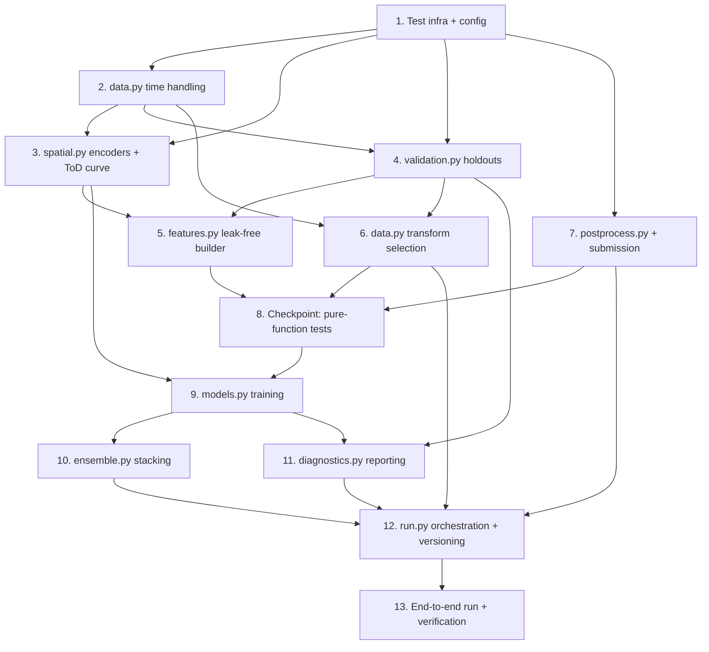

# Implementation Plan: Demand Prediction Overhaul

## Overview

This plan refactors the Stratam pipeline to eliminate train/test leakage, rebuild features from generalizable signal (leak-free geohash encodings, day-48 time-of-day curve, cyclical time encodings, contextual columns), redesign validation to mirror the day-48 → day-49-daytime task, tune for generalization, and preserve the submission contract.

Tasks are ordered so that **pure functions** (time handling, leak-free encoders, validators, feature builder, transform selection, postprocess) are implemented and tested before **model/ensemble wiring** and the **end-to-end run**. Each leak-free / pure component carries its property-based test as an adjacent optional sub-task, so leakage and correctness bugs surface before they propagate into training.

Resolved design decision baked into these tasks: the aligned day-48 → day-49 validator (`build_real_task_holdout`) reports `FAILED_NO_MATCHING_SLOTS` when no day-49 label falls in the test window `[9, 55]`, and the pipeline **logs and proceeds** using the day-48 daytime holdout surrogate (`build_day48_daytime_holdout`) as the **primary model-selection metric**. The pipeline does **not** hard-abort on this condition.

### Testing conventions

- Tests are co-located in a `tests/` directory at the project root.
- Property-based tests use **Hypothesis**, run a **minimum of 100 iterations** each (`@settings(max_examples=100)` or higher), and each correctness Property (1–14) is implemented by exactly **one** property-based test.
- Every property test carries a comment tag in the format: `# Feature: demand-prediction-overhaul, Property N: <property_text>`.
- GBM training is mocked or run on tiny synthetic frames in property/unit tests; the real holdout R² and CV_LB_Gap are observed from an actual run (Task 13), not asserted in CI.
- Tests must run on CPU without a GPU and without network access.

### WSL execution note

The project runs under a Linux virtualenv via WSL. All test and run commands use the form:

```
wsl -d GOD_AI -- bash -lc 'cd /mnt/c/Users/realr/OneDrive/Desktop/Stratam && ./.venv/bin/python <command>'
```

For example, to run the test suite:

```
wsl -d GOD_AI -- bash -lc 'cd /mnt/c/Users/realr/OneDrive/Desktop/Stratam && ./.venv/bin/python -m pytest tests/ -q'
```

## Task Dependency Graph



```json
{
  "waves": [
    { "wave": 1, "tasks": ["1"] },
    { "wave": 2, "tasks": ["2"] },
    { "wave": 3, "tasks": ["3", "4", "6", "7"] },
    { "wave": 4, "tasks": ["5"] },
    { "wave": 5, "tasks": ["8"] },
    { "wave": 6, "tasks": ["9"] },
    { "wave": 7, "tasks": ["10", "11"] },
    { "wave": 8, "tasks": ["12"] },
    { "wave": 9, "tasks": ["13"] }
  ]
}
```

## Tasks

- [x] 1. Set up test infrastructure and update configuration constants
  - Create `tests/` directory with `tests/__init__.py` and a `tests/conftest.py` exposing shared pytest fixtures.
  - Create `tests/strategies.py` with Hypothesis strategies that generate synthetic frames: multiple geohashes (including single-row geohashes and geohashes unseen in test), `day ∈ {48, 49}`, `tod_slot ∈ 0..95` (with morning-only and daytime-inclusive variants), continuous `demand` targets in `~[0, 1]`, and contextual columns (`RoadType`, `NumberofLanes`, `LargeVehicles`, `Landmarks`, `Temperature`, `Weather`) with injectable nulls.
  - Add `hypothesis` and `pytest` to `requirements.txt`.
  - Update `config.py`: remove/deprecate `MAX_LAGS`, `ROLLING_WINDOWS`, `HOLDOUT_FRAC`; add `TEST_TOD_SLOT_MIN = 9`, `TEST_TOD_SLOT_MAX = 55`, `TE_SMOOTHING_ALPHA = 20.0`, `TE_N_FOLDS = 5`, `RECORDED_ONLINE_SCORE = 83.13`, `LEADERBOARD_TOP = 93.13`; keep `SEED = 42`, `N_ESTIMATORS`, `EARLY_STOPPING`, and `seed_everything()` as the single seeding entry point.
  - _Requirements: 6.4_

- [x] 2. Implement time handling and loading in `src/data.py`
  - [x] 2.1 Rewrite `load_data` to parse real time-of-day fields
    - Parse `timestamp` (`HH:MM`) into hour and minute; remove the synthetic `"2026-01-01" + day` calendar and all derived `year/month/dayofweek/...` fields.
    - Construct `abs_time = day * 1440 + hour * 60 + minute`, `tod_slot = (hour * 60 + minute) // 15` (0..95), and retain `day` (48/49) as a feature.
    - Sort by `abs_time` then `geohash`; stop mutating the target in place.
    - _Requirements: 3.2_

- [x] 3. Implement leak-free encoders and the time-of-day curve in `src/spatial.py`
  - [x] 3.1 Implement `TargetEncoder` with Bayesian-smoothed geohash statistics
    - `fit(df_fit, target_col, alpha)`: per-geohash smoothed `geohash_mean = (sum + prior_mean*alpha)/(count + alpha)`, plus `geohash_median`, `geohash_std` (single-row/NaN → 0), `geohash_rank`; store `global_prior_mean`.
    - `transform(df)`: merge encodings by geohash; assign `global_prior_mean` + neutral rank to unseen geohashes.
    - `fit_oof(df_train, target_col, alpha, n_folds, seed)`: produce out-of-fold encodings so a row's encoding never uses its own target.
    - _Requirements: 1.4, 1.5, 3.1, 3.7_
  - [x]* 3.2 Write property test for leak-free geohash encoding
    - **Property 2: Geohash target encodings are leak-free, present, and shrink toward the prior**
    - Assert each row's OOF encoding equals the encoding fit on the complement of its fold, is unchanged when only that row's target is mutated, and each smoothed mean lies between the global prior mean and the raw group mean.
    - **Validates: Requirements 1.4, 1.5, 3.1**
  - [x]* 3.3 Write property test for unseen-geohash fallback
    - **Property 7: Unseen geohashes receive the train-derived fallback encoding**
    - Assert geohashes absent from the training frame receive `global_prior_mean` and the neutral fallback rank.
    - **Validates: Requirements 3.7**
  - [x] 3.4 Implement `fit_tod_curve(df, target_col)` day-48 time-of-day demand curve
    - Mean demand per `tod_slot` computed from day-48 rows of the fitting partition only, spanning the full slot range `0..95`.
    - _Requirements: 3.3, 1.5_
  - [x]* 3.5 Write property test for the day-48 time-of-day curve
    - **Property 3: Day-48 time-of-day curve is correct and leak-free**
    - Assert the curve value for each present slot equals the mean day-48 demand at that slot in the fitting partition and is unchanged when day-49 targets are mutated.
    - **Validates: Requirements 3.3, 1.5**

- [x] 4. Implement task-mirroring validators in `src/validation.py`
  - [x] 4.1 Implement `build_real_task_holdout` and `build_day48_daytime_holdout`
    - Replace `chronological_split` / `time_kfold_split` with a `HoldoutSplit` carrying `train_idx`, `eval_idx`, `status`, `coverage_note`, `kind`.
    - `build_real_task_holdout`: train = day-48 rows, eval = day-49 rows filtered to `tod_slot ∈ [9, 55]`; status `OK` when matching slots exist, `FAILED_NO_MATCHING_SLOTS` (with absence reported) when day-49 rows exist but none fall in `[9, 55]`. Do NOT raise/abort.
    - `build_day48_daytime_holdout`: eval = day-48 rows with `tod_slot ∈ [9, 55]`; train = complement (day-48 outside the window + day-49 morning); documented as the primary surrogate. All artifacts that score this holdout are fit on its train partition only.
    - _Requirements: 2.1, 2.2, 2.3, 2.4, 2.5_
  - [x]* 4.2 Write property test for the real-task split structure
    - **Property 8: Real-task split trains on day 48 and evaluates on aligned day-49 daytime rows**
    - For frames where day-49 includes slots in `[9, 55]`, assert train partition is day-48-only and eval partition is exactly the day-49 rows in `[9, 55]` with status `OK`.
    - **Validates: Requirements 2.1, 2.2, 2.3**
  - [x]* 4.3 Write property test for leak-free fitted artifacts
    - **Property 9: Validator excludes eval-fold targets from all fitted artifacts**
    - Assert encodings, time-of-day curve, and imputation values applied to the eval partition are identical whether or not eval-partition targets are mutated.
    - **Validates: Requirements 2.5**
  - [x]* 4.4 Write unit test for `FAILED_NO_MATCHING_SLOTS` edge case
    - On a morning-only day-49 frame (slots `0..8`), assert `build_real_task_holdout` returns status `FAILED_NO_MATCHING_SLOTS` and does not raise.
    - _Requirements: 2.4_

- [x] 5. Implement the leak-free feature builder in `src/features.py`
  - [x] 5.1 Remove leakage feature groups and the history-tail mechanism
    - Delete `build_compute_df`; delete `lag_*`, `rolling_*`, `ewm_mean_24`, `demand_vs_loc_mean`, `hour_x_loc_rank`, and the synthetic-calendar temporal/cyclical features.
    - _Requirements: 1.1, 1.2, 1.3, 1.6_
  - [x] 5.2 Implement `build_features` over the reduced leak-free feature set
    - Time-of-day cyclical: `tod_sin`/`tod_cos` (period 96), `minute_of_day_sin`/`cos` (period 1440), `is_peak_hour`, `is_night`, `day`.
    - Merge geohash encodings (with unseen fallback) and `tod_curve_mean` joined on `tod_slot`.
    - Contextual columns `RoadType`, `NumberofLanes`, `LargeVehicles`, `Landmarks`, `Temperature`, `Weather` as row features with consistent integer category codes shared across train/test.
    - Must succeed and produce identical feature columns when the target column is absent or all-NaN.
    - _Requirements: 1.1, 1.2, 1.3, 1.6, 3.2, 3.4, 3.5_
  - [x] 5.3 Implement `build_imputers` and null handling in `build_features`
    - `Temperature` → train-only median; `RoadType`/`Weather` → dedicated `"Missing"` category; `NumberofLanes` complete (no imputation). Impute only the columns null in a given row, using fitting-partition-derived values.
    - _Requirements: 3.6_
  - [x]* 5.4 Write property test for leakage-free feature set
    - **Property 1: No feature depends on a row's own or neighboring shifted target**
    - Assert no produced column equals a within-geohash shift/rolling/EWM derivation of the target, and that `build_features` succeeds with the target absent/all-NaN producing the same columns.
    - **Validates: Requirements 1.1, 1.2, 1.3, 1.6**
  - [x]* 5.5 Write property test for cyclical time-of-day encoding
    - **Property 4: Time-of-day cyclical encoding is a unit-circle, periodic mapping**
    - Assert `tod_sin² + tod_cos² ≈ 1` for all slots in `0..95` and that slots differing by a full period map to the same point.
    - **Validates: Requirements 3.2**
  - [x]* 5.6 Write property test for consistent categorical mapping
    - **Property 5: Categorical mapping is consistent across train and test**
    - Assert every category present in both train and test maps to an identical integer code in both encoded frames.
    - **Validates: Requirements 3.5**
  - [x]* 5.7 Write property test for train-derived, null-only imputation
    - **Property 6: Imputation uses train-derived values and touches only null cells**
    - Assert post-imputation columns have no nulls, non-null cells are unchanged, and imputed cells equal the train-derived value (`"Missing"` for `RoadType`/`Weather`, train median for `Temperature`).
    - **Validates: Requirements 3.6**
  - [x]* 5.8 Write unit test for contextual feature presence
    - Assert the six contextual columns appear in the feature set produced by `build_features`.
    - _Requirements: 3.4_

- [x] 6. Implement data-driven transform selection in `src/data.py`
  - [x] 6.1 Implement `select_transform` and `TransformSelectionError`
    - Train identity and `log1p` candidates on the holdout training complement, score the holdout; return the higher Holdout_R2 transform, return `"identity"` on a tie, raise `TransformSelectionError` when both yield Holdout_R2 ≤ 0. Make transform application an explicit, reversible step.
    - _Requirements: 4.2, 4.3, 4.4_
  - [x]* 6.2 Write property test for transform selection
    - **Property 10: Transform selection chooses the higher Holdout_R2**
    - For any pair of holdout R² values, assert `select_transform` returns the higher-R² transform (identity on tie).
    - **Validates: Requirements 4.2**
  - [x]* 6.3 Write unit tests for transform selection edge cases
    - Tie → identity (4.3); both Holdout_R2 ≤ 0 → `TransformSelectionError` with the no-positive-transform message (4.4).
    - _Requirements: 4.3, 4.4_

- [x] 7. Implement postprocessing and submission writing in `src/postprocess.py`
  - [x] 7.1 Implement `postprocess(preds, transform, train_path, target_col)`
    - Inverse-transform (`expm1`) only when transform is `log1p`; clip to `[0, train_max]` where `train_max` is the max demand in `train.csv`; remove integer rounding; replace residual `NaN`/`Inf` with the global train-mean non-negative fallback.
    - _Requirements: 5.4, 5.5, 5.6_
  - [x] 7.2 Implement `write_submission(preds, test_idx, test_path, submission_path, target_col, id_col)`
    - Write exactly 41,778 data rows with columns `Index` and `demand`; populate `Index` from `test.csv` reindexed to original test order; assert row count equals test row count and output is null-free.
    - _Requirements: 5.1, 5.2, 5.3_
  - [x]* 7.3 Write property test for the submission contract
    - **Property 11: Submission contract — row count, columns, and Index order**
    - Assert the written submission has one data row per test row, exactly columns `Index` and `demand`, and `Index` equals the test frame's `Index` in original order.
    - **Validates: Requirements 5.1, 5.2, 5.3**
  - [x]* 7.4 Write property test for prediction bounds
    - **Property 12: Predictions are bounded to [0, train_max]**
    - For raw prediction vectors including negative and over-range values, assert every postprocessed value is in `[0, train_max]`.
    - **Validates: Requirements 5.4, 5.5**
  - [x]* 7.5 Write property test for null-prediction fallback
    - **Property 13: Null predictions are replaced by a non-negative fallback**
    - For vectors containing `NaN`/`Inf`, assert the output is null-free and each such value is replaced by the defined non-negative fallback.
    - **Validates: Requirements 5.6**

- [x] 8. Checkpoint - Ensure all pure-function tests pass
  - Run the property and unit tests for Tasks 2–7 via WSL: `wsl -d GOD_AI -- bash -lc 'cd /mnt/c/Users/realr/OneDrive/Desktop/Stratam && ./.venv/bin/python -m pytest tests/ -q'`.
  - Ensure all tests pass, ask the user if questions arise.

- [x] 9. Implement generalization-first model training in `src/models.py`
  - [x] 9.1 Re-tune trainers and wire leak-free OOF + early stopping
    - Retain `train_lightgbm`/`train_xgboost`/`train_catboost` with GPU→CPU fallback; move hyperparameters to a stronger-regularization regime (lower depth/leaves, higher min-child/L2); generate out-of-fold predictions with `TE_N_FOLDS`-fold leak-free OOF encodings; use the day-48 daytime surrogate holdout for early stopping; consume only the leak-free encoded features.
    - _Requirements: 4.1, 4.5, 4.6_
  - [x] 9.2 Implement `train_baseline(train_part, eval_part, encoder, tod_curve)`
    - Robust floor model: blend of leak-free geohash mean and day-48 time-of-day curve (`w*geohash_mean + (1-w)*tod_curve_mean`) with unseen-geohash fallback to the curve / global prior.
    - _Requirements: 4.1_
  - [x]* 9.3 Write unit test for leak-free trainer wiring
    - Assert trainers receive only the leak-free feature set (no `lag_*`/`rolling_*`/`ewm_*` columns) and that early stopping uses the surrogate holdout eval set.
    - _Requirements: 4.1, 4.6_

- [x] 10. Implement stacking with a baseline floor in `src/ensemble.py`
  - [x] 10.1 Update `stack_predictions(results, y_train, baseline_result)`
    - Fit the Ridge meta-learner on out-of-fold predictions only (retain non-negative-weight fallback); include the baseline model in the stack or as a floor so the ensemble cannot score worse than the baseline on the surrogate holdout.
    - _Requirements: 4.5_
  - [x]* 10.2 Write unit test for OOF-only meta-learner fitting
    - Assert the Ridge meta-learner is fit on OOF rows only and the baseline floor is applied.
    - _Requirements: 4.5_

- [x] 11. Implement honest reporting in `src/diagnostics.py`
  - [x] 11.1 Add metrics and printouts for local score and CV_LB_Gap
    - Report baseline holdout R², per-model Holdout_R2, ensemble Holdout_R2, `local_score = max(0, 100*r2)`, `cv_lb_gap = |local_score − recorded_online_score|`, `leaderboard_top = 93.13`, and `real_task_validation_status`; retain feature importance and SHAP.
    - _Requirements: 2.6, 2.7, 6.1_
  - [ ]* 11.2 Write unit test for metrics reporting fields
    - Assert the metrics dict contains `holdout_r2`, `local_score = max(0, 100*r2)`, `cv_lb_gap = |local_score − online_score|`, `leaderboard_top = 93.13`, and `real_task_validation_status`.
    - _Requirements: 2.6, 2.7, 6.1_

- [x] 12. Wire orchestration and versioned outputs in `run.py`
  - [x] 12.1 Implement the new pipeline order and proceed-on-surrogate logic
    - Order: `load_data → build_holdouts → fit encoders/curve/imputers on holdout-train → build_features → select_transform → train models + baseline (early-stop on surrogate holdout) → stack → refit encoders on full train → build test features → predict → postprocess → diagnostics → write_submission`.
    - When `build_real_task_holdout` returns `FAILED_NO_MATCHING_SLOTS`, log the absence and proceed using `build_day48_daytime_holdout` as the primary model-selection metric (no hard abort).
    - Relax the CUDA assertion to a warning with CPU fallback; call `seed_everything(SEED)` once before any stochastic step.
    - _Requirements: 2.4, 4.6, 6.4_
  - [x] 12.2 Implement versioned output writing
    - Write `submission_N.csv`, `metrics_N.json`, `feature_importance_N.{csv,png}`, `shap_summary_N.png` with incremented run id; write `submission.csv` and `metrics.json` copies.
    - _Requirements: 5.7, 5.8_
  - [-]* 12.3 Write property test for prediction determinism
    - **Property 14: Predictions are deterministic given seed and inputs**
    - On a small synthetic frame (CPU), assert two successive executions of the prediction path produce identical predicted demand vectors within `[0, train_max]`.
    - **Validates: Requirements 6.5, 6.4**
  - [-]* 12.4 Write integration test for versioning and end-to-end smoke
    - On a tiny synthetic dataset (CPU, GBM mocked or minimal), assert the run id increments, `submission_N.csv`/`metrics_N.json` and the `submission.csv` copy are written, a valid submission is produced, and `leaderboard_top = 93.13` is recorded (99.99 is a documented non-goal, no automated assertion).
    - Run via WSL: `wsl -d GOD_AI -- bash -lc 'cd /mnt/c/Users/realr/OneDrive/Desktop/Stratam && ./.venv/bin/python -m pytest tests/ -q'`.
    - _Requirements: 5.7, 5.8, 6.2, 6.3_

- [ ] 13. End-to-end run, submission-contract verification, and honest scoring
  - Run the real pipeline via WSL: `wsl -d GOD_AI -- bash -lc 'cd /mnt/c/Users/realr/OneDrive/Desktop/Stratam && ./.venv/bin/python run.py'` to produce `submission_N.csv` and `metrics_N.json`.
  - Verify the submission contract on the produced file: exactly 41,778 data rows, exactly columns `Index` and `demand`, `Index` matching `test.csv` order, and all `demand` values within `[0, train_max]` and null-free (e.g. via `./.venv/bin/python verify_submission.py N` and/or a contract-check script).
  - Read `metrics_N.json` and report the surrogate-holdout local score and `cv_lb_gap = |local_score − 83.13|` versus the recorded online score 83.13 and the leaderboard top 93.13.
  - _Requirements: 2.6, 2.7, 5.1, 5.2, 5.3, 5.4, 5.5, 6.1, 6.2_

## Notes

- Tasks marked with `*` are optional test sub-tasks and can be skipped for a faster MVP; core implementation tasks are never optional.
- Each correctness Property 1–14 maps to exactly one property-based test: P1→5.4, P2→3.2, P3→3.5, P4→5.5, P5→5.6, P6→5.7, P7→3.3, P8→4.2, P9→4.3, P10→6.2, P11→7.3, P12→7.4, P13→7.5, P14→12.3.
- Pure functions (Tasks 2–7) are implemented and tested before model/ensemble wiring (Tasks 9–10) and the end-to-end run (Tasks 12–13).
- All test and pipeline commands run under the WSL Linux venv as noted in each relevant task.
- This workflow produces planning and implementation artifacts only; source code is not modified as part of writing this plan.
